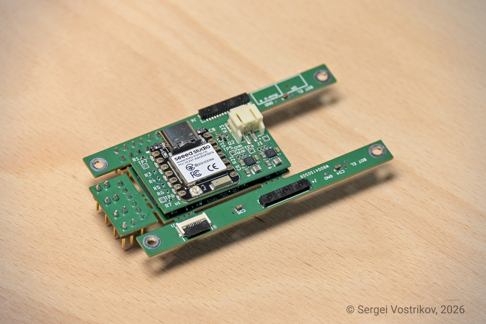
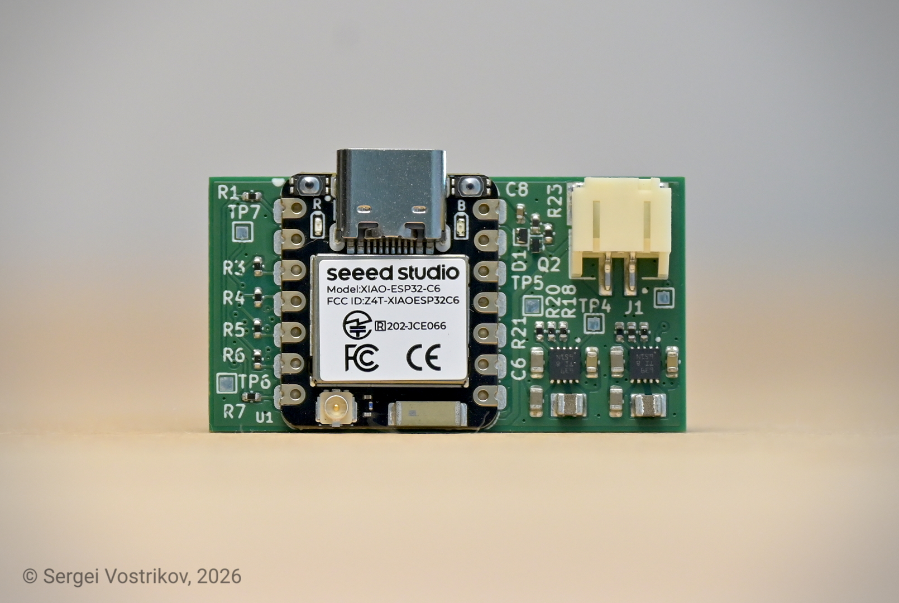

# WULPUS Pro Max
## Multi-mode Ultra-Low-Power Wearable Ultrasound Platform
> WULPUS Pro Max adopts the core analog front end of the original [WULPUS PRO design](https://github.com/pulp-bio/wulpus-pro), while extending its analog performance, firmware architecture, host connectivity, and software tooling. The project is independently developed and maintained by [Sergei Vostrikov](https://github.com/Sergio5714) and contributors.

<p align="center">
  
  <br/>
  WULPUS Pro Max module with PolyCMUT transducer.
</p>

## Table of contents

- [Introduction](#introduction)
  - [Hardware photos](#hardware-photos)
  - [System diagram](#system-diagram)
  - [Specifications](#specifications)
- [Clone the repository](#clone-the-repository)
- [Structure of the repository](#structure-of-the-repository)
- [Documentation](#documentation)
- [Build Instructions](#build-instructions)
- [Host setup and operation](#host-setup-and-operation)
  - [WULPUS Pro Max WiFi host PCB (WiFi/USB CDC)](#wulpus-pro-max-wifi-host-pcb-wifiusb-cdc)
  - [WULPUS Pro Max + nRF52 DK + nRF Dongle (BLE)](#wulpus-pro-max--nrf52-dk--nrf-dongle-ble)
- [Citation](#citation)
- [Changelog](#changelog)
- [Authors](#authors)
- [License](#license)
  - [Limitation of Liability](#limitation-of-liability)

# Introduction

WULPUS Pro Max is a modular wearable ultrasound platform for research and
development. It combines a tightly integrated, flexible ultrasound acquisition
front end with a dedicated host board and a mature software stack. Together,
these components provide a complete path from transducer excitation and signal
acquisition to device control, data streaming, visualization, and analysis.

The modular architecture supports both wearable experiments and benchtop
operation:

- **Benchtop operation:** connect a single USB-C cable for power delivery,
  device configuration, and data transfer over USB CDC.
- **Wireless operation:** connect a LiPo battery with a 2-pin JST connector to the
  host board and use Wi-Fi/TCP for seamless, cable-free operation. The host
  board also provides integrated battery charging and protection.

> **Note:** The same USB-C cable can flash and update the entire device without
> external programming tools.

WULPUS Pro Max reliably delivers raw ultrasound data to the host system either
over the air or through a USB cable, with state-of-the-art pulse repetition
frequencies (PRFs) of up to **500 Hz**. The common Python software stack supports
both links, providing the same tools and workflows in either operating mode.

## Hardware photos

<table>
  <tr>
    <td colspan="2" align="center">
      
      <br/>
      Assembled WULPUS Pro Max system
    </td>
  </tr>
  <tr>
    <td width="50%" align="center">
      
      <br/>
      WULPUS PRO Acquisition PCB<br/>
      (development version with test and debug headers)
    </td>
    <td width="50%" align="center">
      
      <br/>
      WULPUS Pro Max WiFi host PCB
    </td>
  </tr>
</table>

## System diagram

<p align="center">
  
  <br/>
  WULPUS Pro Max system diagram
</p>

## Specifications

WULPUS Pro Max builds on the original [WULPUS](https://github.com/Sergio5714/wulpus) platform and keeps the same low-power wearable ultrasound philosophy while making a substantial leap in specifications and extending the hardware and communication options. The table below compares the main features of WULPUS Pro Max with those of the original WULPUS platform.

| Feature | WULPUS<br>(v1.2.4) | WULPUS Pro Max |
| --- | --- | --- |
| Number of channels | 8, time-multiplexed | **16**, time-multiplexed |
| Supported transducers | PZT transducers | PZT transducers, **CMUTs** |
| Excitation amplitude | 15 V unipolar | **30 V** unipolar |
| Excitation frequency | ~100 kHz to 4 MHz | ~100 kHz to **10 MHz** |
| Transducer biasing | - | Indirect or direct **bias**, **-30 V or 30 V** |
| Analog front-end | 10 dB LNA + 30.8 dB PGA | 6 dB LNA + **70 dB VGA** |
| Receive-path<br>SNR | - | Approximately **45 dB** in the passband at 41.9 dB total gain;<br>**>=30 dB** at 3 MHz |
| Receive-path<br>bandwidth | &lt;1.4 MHz | Amplification-only: up to **14 MHz**;<br>end-to-end -3 dB: **1.4 MHz** |
| TGC support | No (fixed gain) | **Yes** (linear profile) |
| Maximum PRF | 50 Hz | **500 Hz**<br>(with WiFi host PCB over Wi-Fi/TCP or USB CDC) |
| Power budget at 50 Hz PRF | <=25 mW | <=40 mW |
| Data link | BLE | **USB**, **Wi-Fi**, or **BLE** |
| Form factor | 46 x 25 mm footprint | **40 x 20 mm** footprint |

Full WULPUS Pro Max specifications are available in [docs/full_specifications.md](docs/full_specifications.md).

# Clone the repository

Clone the public repository without its private development submodule:

```bash
git clone https://github.com/Sergio5714/wulpus-pro-max.git
```

The `hw/kicad_us_lib` submodule is an internal development library hosted in a
private repository. External users do not have access to it and do not need to
initialize it to use the released fabrication outputs. For editing the KiCad
designs, generate project-specific symbol and footprint libraries from the
symbols and footprints embedded in the corresponding project files. See the
[hardware README](hw/README.md#internal-kicad-library) for details.

Authorized developers can initialize the private submodule after cloning:

```bash
git submodule update --init --recursive
```

# Structure of the repository

The repository is organized into four top-level folders. See the README files
inside them for component-level details.

- [`hw`](hw) — PCB design and fabrication files.
- [`fw`](fw) — embedded firmware source code.
- [`sw`](sw) — Python software, graphical interfaces, and notebooks.
- [`docs`](docs) — project documentation and images.

# Documentation

- [Full system specifications](docs/full_specifications.md)
- [Host board options](docs/host_board_options.md)
- [PCB designs and fabrication](hw/README.md)
- Firmware:
  - [ESP32 host firmware](fw/esp32/README.md)
  - [MSP430 acquisition firmware](fw/msp430/README.md)
  - [Legacy nRF52 BLE firmware](fw/nrf52/README.md)
- [Python software and notebooks](sw/README.md)

For background information about the original WULPUS platform, see the
[legacy WULPUS User Manual](https://github.com/Sergio5714/wulpus/blob/main/docs/wulpus_user_manual.pdf).

# Build Instructions

The WULPUS Pro Max WiFi host PCB provides a one-cable setup and programming
workflow:

1. **Get hardware**

   Order the [Acquisition PCB](docs/images/v1_0/eval_board_main.jpg) and [WiFi host PCB](docs/images/v1_2/wifi_board_top.jpg) using the [PCBWay shared projects](hw/README.md#pcbway-shared-projects), or manufacture and assemble them yourself using the design files, schematics, and bills of materials linked in the [hardware guide](hw/README.md#included-pcb-designs).

2. **Install the host software**

   Download the latest compiled desktop application from
   [GitHub Releases](https://github.com/Sergio5714/wulpus-pro-max/releases), or
   follow the [software installation instructions](sw/docs/dependency_installation.md)
   to run it from source.

3. **Flash the firmware**

   - Connect the WiFi host PCB to the Acquisition PCB, then connect the host PCB to the PC with a single USB-C cable.
   - Follow the [firmware update guide](docs/firmware_update_guide.md) to install
     released ESP32 and MSP430 packages with the graphical updater.

   > No external programmer, adapter board, or additional programming cables are required for this workflow.

   > **Note:** The ESP32 and MSP430 firmware can be customized. Firmware
   > developers should follow the [ESP32 development guide](fw/esp32/docs/development_guide.md)
   > and [MSP430 development guide](fw/msp430/README.md#build-and-export-firmware)
   > to configure and compile custom images.

# Host setup and operation

WULPUS Pro Max supports multiple host-board configurations. See
[Host board options](docs/host_board_options.md) for a comparison. Instructions
for getting started with each configuration are provided below.

## WULPUS Pro Max WiFi host PCB (WiFi/USB CDC)

1. Connect the [WULPUS Pro Max WiFi host PCB](docs/images/v1_2/wifi_board_top.jpg) to the [Acquisition PCB](docs/images/v1_0/eval_board_main.jpg).
2. Connect the host PCB to the PC with a data-capable USB-C cable. This connection powers both PCBs.
3. Start the desktop application. See the
   [desktop GUI usage guide](sw/docs/desktop_gui_usage.md) for source and
   packaged application instructions.
4. For a wired connection, select **USB CDC**, scan for devices, and connect to
   the ESP32-C6 port. For a wireless connection, first complete
   [WiFi provisioning](fw/esp32/docs/wifi_provisioning_guide.md), then select
   **WiFi**, scan, and connect to the device.
5. Configure the acquisition in the **Ultrasound Configuration** tab, then use
   the **Acquisition** tab to start acquisition and optionally save an NPZ file.

For development with a standalone XIAO ESP32-C6, follow its [wiring and power requirements](fw/esp32/docs/development_guide.md#supported-boards) and the [pin mapping](fw/esp32/docs/development_guide.md#pin-mapping). This setup requires an Acquisition PCB with the MSP430 firmware already programmed.

## WULPUS Pro Max + nRF52 DK + nRF Dongle (BLE)

> The nRF52 BLE option may suit applications that need even lower power
> consumption than the WiFi host solution. It is a legacy, unsupported option
> and is not recommended for new setups. Using it requires additional
> integration work, including manual wiring, external power, and a separate
> programmer for the MSP430.

1. Connect the nRF52 DK to the Acquisition PCB using the pin mapping documented in [fw/nrf52/README.md](fw/nrf52/README.md).
2. Plug in the USB dongle and power the nRF52 DK via USB.
3. Check the dongle connection. The green LED should light up. If it does not, press the reset button on the nRF52 DK and try again.
4. After confirming dongle connectivity, power the Acquisition PCB through the connector or debug pin headers.
5. Start the desktop application as described in the
   [desktop GUI usage guide](sw/docs/desktop_gui_usage.md).
6. Select **BLE**, scan for the dongle, connect, configure the acquisition, and
   start it from the **Acquisition** tab.

# Citation

Please cite our [arXiv preprint](https://arxiv.org/abs/2607.12137):

```bibtex
@article{vostrikov2026wulpuspro,
  title={WULPUS PRO: Multi-mode Ultra-Low-Power Wearable Ultrasound and Array Imaging with CMUT Support},
  author={Vostrikov, Sergei and Villani, Federico and Hirschi, Cedric and Lu, Jinhao and Welsch, Jonas and Angerer, Martin and Cretu, Edmond and Rohling, Robert and Cossettini, Andrea and Benini, Luca},
  journal={arXiv preprint arXiv:2607.12137},
  year={2026},
  url={https://arxiv.org/abs/2607.12137}
}
```

If you would like to cite this repository, please use:

```bibtex
@misc{wulpus_pro_repo_sergio5714_2026,
  title={WULPUS Pro Max: Multi-mode Ultra-Low-Power Wearable Ultrasound Platform (Independently Maintained)},
  author={Vostrikov, Sergei and Villani, Federico and Hirschi, Cedric and Cossettini, Andrea and Benini, Luca},
  year={2026},
  howpublished={GitHub repository},
  url={https://github.com/Sergio5714/wulpus-pro-max}
}
```

# Changelog

See [CHANGELOG.md](CHANGELOG.md) for release notes and main project changes.

# Authors

Since 2025,
[Sergei Vostrikov](https://scholar.google.com/citations?user=a0KNUooAAAAJ&hl=en)
(@Sergio5714) has independently maintained this repository and continued
developing WULPUS Pro Max, with contributions from others.

The initial WULPUS PRO system was developed from 2024 to 2025 as a research
project at the [Integrated Systems Laboratory (IIS)](https://iis.ee.ethz.ch/)
at ETH Zurich by:

- [Sergei Vostrikov](https://scholar.google.com/citations?user=a0KNUooAAAAJ&hl=en) (PCB design, firmware, software, open-sourcing)
- [Federico Villani](https://scholar.google.com/citations?user=5LgLMCEAAAAJ&hl=en) (PCB design, component selection)
- [Cedric Hirschi](https://www.linkedin.com/in/c%C3%A9dric-cyril-hirschi-09624021b/) (firmware, software)
- [Andrea Cossettini](https://scholar.google.com/citations?user=d8O91jIAAAAJ&hl=en) (supervision, project administration)
- [Luca Benini](https://scholar.google.com/citations?hl=en&user=8riq3sYAAAAJ) (supervision, project administration)

Additional contributors to the project were:

- [Sebastian Frey](https://scholar.google.com/citations?user=7jhiqz4AAAAJ&hl=en), ETH Zürich (design review)
- [Alfonso Blanco Fontao](https://www.linkedin.com/in/alfonso-blanco-fontao-b6214726/), ETH Zürich (design review, PCB fabrication coordination)
- [Ciara Giles Doran](https://www.linkedin.com/in/ciaragilesdoran/) (preliminary evaluation of the AD8338 VGA)

# License

The following files are released under Apache License 2.0 (`Apache-2.0`) (see `sw/LICENSE`):

- `sw/`

The hardware designs are released under Solderpad v0.51 (`SHL-0.51`):

- `hw/`

See the [hardware license table](hw/README.md#license) for the applicable license file and copyright holder for each PCB design.

Project-authored firmware code is generally licensed under Apache-2.0, as
identified in the source-file headers. Bundled vendor and third-party code
retains its original license, including BSD-style terms for Texas Instruments
sources and the Nordic Semiconductor license for Nordic SDK sources. See the
license notices and source headers in `fw/esp32/`, `fw/msp430/`, and `fw/nrf52/`
for the terms that apply to each file.

## Limitation of Liability

In no event and under no legal theory, whether in tort (including negligence), contract, or otherwise, unless required by applicable law (such as deliberate and grossly negligent acts) or agreed to in writing, shall any Contributor be liable to You for damages, including any direct, indirect, special, incidental, or consequential damages of any character arising as a result of this License or out of the use or inability to use the Work (including but not limited to damages for loss of goodwill, work stoppage, computer failure or malfunction, or any and all other commercial damages or losses), even if such Contributor has been advised of the possibility of such damages.
